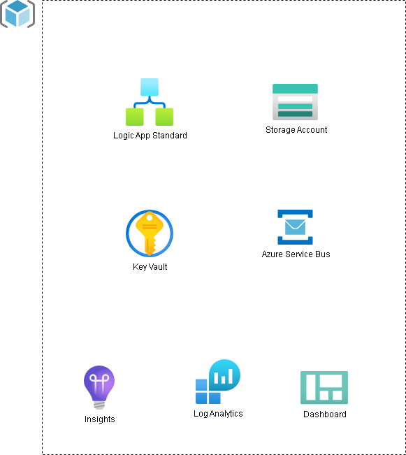

# Logic App Consumption. The budget option.
## "Without Visual Studio Logic App Designer"

Logic App Consumption is Microsoft's low code offering for implementing enterprise integrations. It offers [**Connectors**](https://learn.microsoft.com/en-us/azure/connectors/built-in) which can save you time from building everything yourself.

This templates includes a Logic App Consumption deployment and some popular connections. 

### Application architecture



This template utilizes the following Azure resources:

- [**Azure Logic App Consumption**](https://docs.microsoft.com/azure/logic-apps/) to design the workflows
- [**Azure Monitor**](https://docs.microsoft.com/azure/azure-monitor/) for monitoring and logging
- [**Azure Key Vault**](https://docs.microsoft.com/azure/key-vault/) for securing secrets
- [**Azure Service Bus**](https://docs.microsoft.com/azure/service-bus/) for (reliable) messaging


### How to get started

1. Install Visual Studio Code with Azure Logic Apps (Standard) and Azure Functions extensions
1. Create a new folder and switch to it in the Terminal tab
1. Run `azd login`
1. Run `azd init -t https://github.com/marnixcox/logicapp-consumption`

Now the magic happens. The template contents will be downloaded into your project folder. This will be the next starting point for building your integrations.

### Contents

The following folder structure is created. Where `corelocal` is added to extend the standard set of core infra files.

```
├── infra                      [ Infrastructure As Code files ]
│   ├── main.bicep             [ Main infrastructure file ]
│   ├── main.parameters.json   [ Parameters file ]
│   ├── app                    [ Infra files specifically added for this template ]
│   ├── core                   [ Full set of infra files provided by AzdCli team ]
│   └── corelocal              [ Extension on original core files to enable private endpoint functionality ]
├── src                        [ Application code ]
│   └── workflows              [ Azure Logic App Consumption ]
└── azure.yaml                 [ Describes the app and type of Azure resources ]

```

### Provision Infrastructure and Logic App Consumption

Let's first provision the infra components. 

- Run `azd provision`

First time an environment name, subscription and location need to be selected. These will then be stored in the `.azure` folder.


Resource group and all components will be created. Also Logic App Consumption are being deployed/provisioned using infra code.


### Designer

With the lack of a decent designer in either Visual Studio and Visual Studio Code the Logic App needs to be created directly in the Azure Portal. After creating/updating the code needs to be copied over/into the local workflow json file.

### Connections

The following connections are currently implemented: 

`servicebus`
`office365`
`sharepointonline`
`azureblob`


