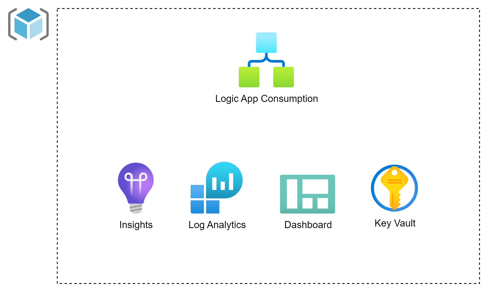

# Logic App Consumption
### template to deploy comsumption based workflows

Logic App Consumption is Microsoft's low code offering for implementing enterprise integrations. It offers [**Connectors**](https://learn.microsoft.com/en-us/azure/connectors/built-in) which can save you time from building everything yourself.

This templates includes a Logic App Consumption deployment and some popular connections. 

### Application architecture



This template utilizes the following Azure resources:

- [**Azure Logic App Consumption**](https://docs.microsoft.com/azure/logic-apps/) to design the workflows
- [**Azure Monitor**](https://docs.microsoft.com/azure/azure-monitor/) for monitoring and logging
- [**Azure Key Vault**](https://docs.microsoft.com/azure/key-vault/) for securing secrets


### How to get started

1. Install Visual Studio Code with Azure Logic Apps (Standard) and Azure Functions extensions
1. Create a new folder and switch to it in the Terminal tab
1. Run `azd auth login`
1. Run `azd init -t https://github.com/marnixcox/logicapp-consumption`

Now the magic happens. The template contents will be downloaded into your project folder. This will be the next starting point for building your integrations.

### Contents

The following folder structure is created. Where `corelocal` is added to extend the standard set of core infra files.

```
├── infra                      [ Infrastructure As Code files ]
│   ├── main.bicep             [ Main infrastructure file ]
│   ├── main.parameters.json   [ Parameters file ]
│   ├── app                    [ Infra files specifically added for this template ]
│   └── core                   [ Full set of infra files provided by AzdCli team  ]
├── src                        [ Application code ]
│   └── workflows              [ Azure Logic App Consumption ]
└── azure.yaml                 [ Describes the app and type of Azure resources ]

```

### Provision Infrastructure and Logic App Consumption

Let's first provision the infra components. Add a `resourceToken` parameter to the `main.parameters.json` to set the application name or leave it out to have a random name generated.

```
 "resourceToken": {
      "value": "appname"
    }
```

- Run `azd provision`

First time an environment name, subscription and location need to be selected. These will then be stored in the `.azure` folder.


Resource group and all components will be created. Also Logic App Consumption are being deployed/provisioned using infra code.


### Connections

The following connections are currently implemented: 

`servicebus`
`office365`
`sharepointonline`
`azureblob`
`common data service`

### CI/CD

This template includes pipelines for a staged dev/tst/acc/prd deployment for a `develop` and `main` branch. Make sure to update the `serviceConnection` and  `AZURE_SUBSCRIPTION_ID` accordingly. 


